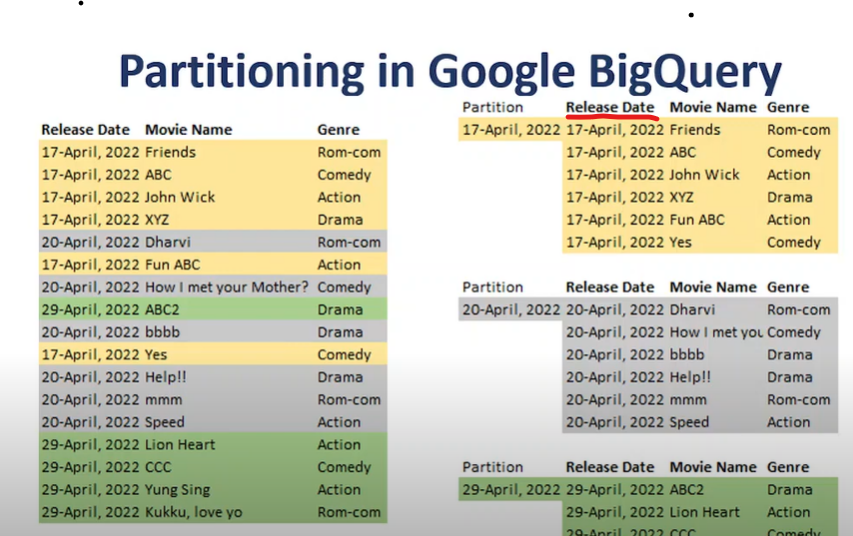
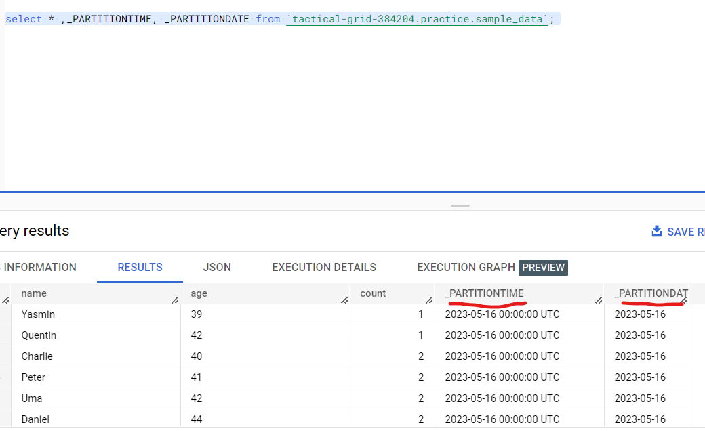

# Partitioning & Clustering

## Partitioning

- Organize data in table that can be stored and queried efficiently.
- Divide data into smaller pieces called partitions based on partition column/key.
- Each partition is stored in a separate location, & represents subset of data.
- This allows BigQuery to scan only relevant partitions instead of scanning entire table when using a where clause on partition column, this process is called **Pruning**.
- Max Partitons: 4000
- We can have **NULL** value in partition column and all null values will be stored in separate partition (Null partition).

    

## Partition Types

1. Ingestion time partitioning
2. Time-unit column partitioning
3. Integer range partitioning

## Ingestion time partitioning

- Tables are partitioned based on the timestamp when the data is uploaded on the BigQuery
- You can choose between daily, hourly, monthly, and yearly granularity for the partitions.
- To execute the queries, BigQuery creates two pseudo columns called **_PARTITIONTIME** and **_PARTITIONDATE**
- BigQuery stores the ingestion time for each row here.
- It is similar to Time-unit column partitioning.

    

- A great way to take advantage of an ingestion-time partitioned table is to use a pseudocolumn, such as _PARTITIONDATE or_PARTITIONTIME in the query.

    ```sql
    SELECT
    *
    FROM
    `project-id.dataset.newtable`
    WHERE
    _PARTITIONTIME BETWEEN TIMESTAMP('2021-09-18') AND TIMESTAMP('2021-09-21')
    ```

## Time-unit column partitioning

- It requires the tables to be partitioned based on a TIMESTAMP, DATE, or DATETIME column field.

    ```sql
    CREATE TABLE
    `project-id.dataset-id.newtable` 
    (first_name STRING,
        last_name STRING,
        date_registered DATE)
    PARTITION BY
    date_registered AS
    SELECT
    first_name,
    last_name,
    date_registered
    FROM
    `project-id.dataset-id.customers`
    ```

## Integer range partitioning

- To create an integer-range partition table, you need to provide four arguments:
  - the integer-type column name,
  - the starting value,  
  - ending value,
  - and the interval between the ending and starting values.
  
---

<br>

## Clustering

- Clusters will allow BigQuery to keep data that is similar closer together, allowing a query to scan fewer data.

- Based on the values in the column you chose for clustering, BigQuery will automatically sort these values and also decide on how to store them in optimal storage blocks.

- BigQuery has a limit of **4 cluster** columns per table.

Use Clustering under the following circumstances:

- The queries that you want to execute mostly use filters and aggregation.
- The **cardinality** of the number of values in a column or group of columns is **large**.

    ```sql
    CREATE OR REPLACE TABLE
    `datastic.stackoverflow.questions_clustered`
    CLUSTER BY
    tags AS (
    SELECT
        *
    FROM
        `datastic.stackoverflow.questions`)
    ```