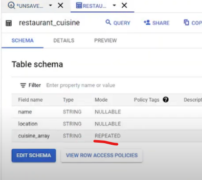
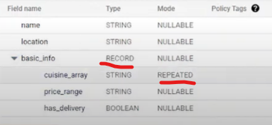

## Repeated

```sql
CREATE OR REPLACE TABLE `array_and_struct_demo.restaurant_cuisine` AS (
SELECT "Cafe Pacific" AS name, "North York" AS location, ["European", "Casual", "Wine bar"] AS cuisine_array
UNION ALL
SELECT "Boston Pizza" AS name, "Toronto" AS location, ["Italian", "Pizza", "Fast-food"] AS cuisine_array
UNION ALL
SELECT "Spice on the Streets" AS name, "New York" AS location, ["Indian", "Casual", "Street-food"] AS cuisine_array
UNION ALL
SELECT "Sushi Bar" AS name, "LA" AS location, ["Japanese", "Sushi", "Casual"] AS cuisine_array);
```

- When the mode is **Repeated**, it means it is array
  

## Unnest

- Flattens/denormalizes the Array.
  
    ```sql
    SELECT name, location, cuisine
    FROM `array_and_struct_demo.restaurant_cuisine`, 
    UNNEST(cuisine_array) AS cuisine;

    ```


## Nested/Record

```sql
CREATE OR REPLACE TABLE `array_and_struct_demo.struct_restaurant_cuisine` AS (
SELECT "Cafe Pacific" AS name, "North York" AS location,
STRUCT(["European", "Casual", "Wine bar"] AS cuisine_array, "100 $" AS price_range, False AS has_delivery) AS basic_info
UNION ALL
SELECT "Boston Pizza" AS name, "Toronto" AS location,
STRUCT(["Italian", "Pizza", "Fast-food"] AS cuisine_array, "50 $" AS price_range, True AS has_delivery) AS basic_info
UNION ALL
SELECT "Spice on the Streets" AS name, "New York" AS location,
STRUCT(["Indian", "Casual"] AS cuisine_array, "50 $" AS price_range, True AS has_delivery) AS basic_info
UNION ALL
SELECT "Sushi Bar" AS name, "LA" AS location,
STRUCT(["Japanese", "Sushi", "Casual"] AS cuisine_array, "150 $" AS price_range, False AS has_delivery) AS basic_info);

```

When the data type is **Record**, it means it is *struct/nested/json*.




Ref: https://github.com/AnandDedha/GCP/blob/main/BigQuery/array-struct-example.sql
